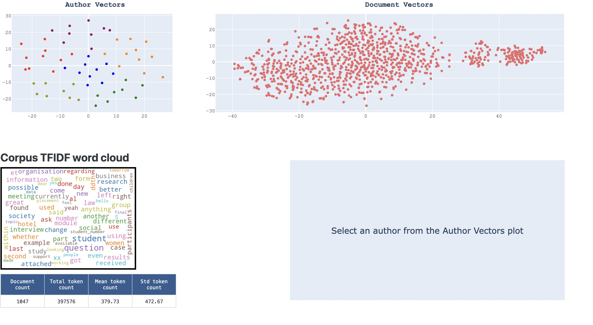
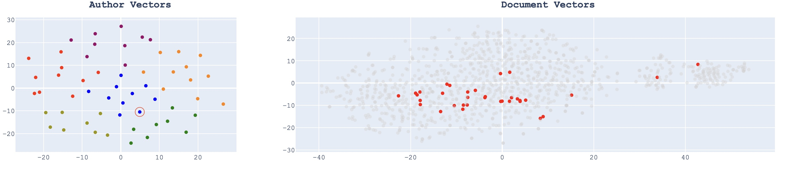
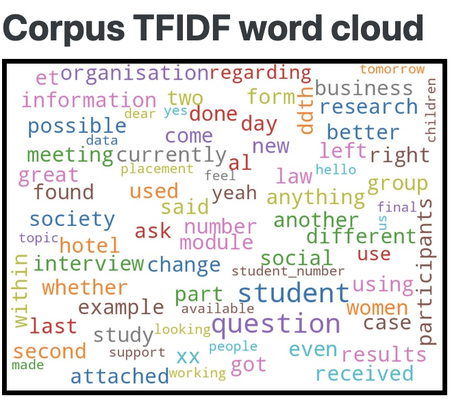
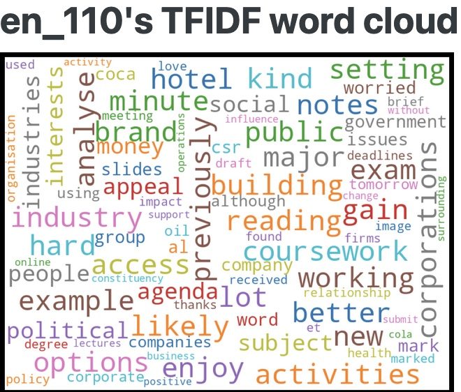
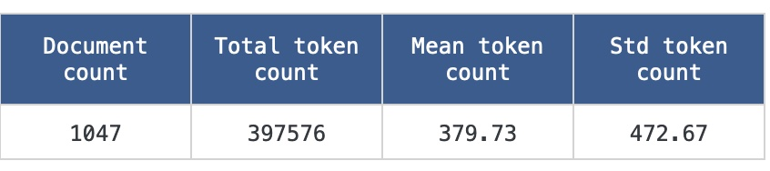
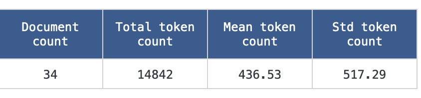
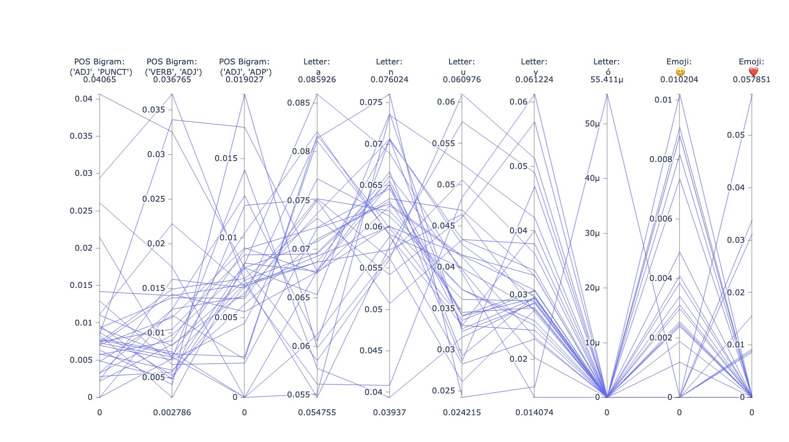

# Authorship Analysis
This repository holds code for my CSE 564 final project. It is a dashboard for visualizing document and author level feature vectors pertaining to my IARPA HIATUS research project.

# Note:

This dashboard was developed on a 13.3 inch M1 Macbook Air 2560 x 1600 resolution. Any other screen sizes may affect the layout.

# Background

What **grammatical choices** do authors subconsciously make when writing documents? Can we extract these stylistic features and **store them in high-dimensional vectors** to aid in the task of automatic **authorship identification**? Which of these grammatical features are useful for prediction and which are not?

I am on an IARPA grant called HIATUS for this authorship identification task in which we perform grammatical feature extraction to create these high dimensional vectors. This dashboard acts as a tool for visualizing trends and useful information about corpora and the vectors created from said corpora. 

The underlying assumption with these vectors is that documents written by the same author will be grammatically similar to each other and thus form clusters in a vector space (author space). 

# Visualizations

Upon loading/refresh, the user is greeted with the following page:

 

## `Author Vectors` 

An `author vector` is just the average of an author's document vectors. In this plot, the vectors are ran through MDS to reduce their dimensions to 2. They are also colored via k-means clustering, so authors with the same color are more similar. 

Upon clicking an author in this plot, that author's document vectors will be highlighted in the `Document Vectors` plot and the other documents fade into the background:

## `Document Vectors`

My feature extraction algorithm (called `Gram2Vec`) works on the document level, thus producing these `document vectors`. These vectors (and the author vectors) are fully explainable such that each index position corresponds to the (normalized) relative frequency of a grammatical feature. Examples of features being looked for are:
- POS Unigram: ADJ
- POS Bigram: ("DET", "NOUN") 
- Function word: "for"
- Letter: "A"
 
And over 400 more like this.

## TFIDF Wordcloud 

Word clouds typically display words based off frequency. One drawback to this is that high frequency words tend to be words with less significant semantic meaning (a.k.a function words like "the", "he", "that", "from", and so on). `TFIDF Word clouds` instead utilize `T`erm `F`requency `I`nverse `D`ocument `F`requency. That's just a fancy term for "put negative weights on words that appear more frequenty across all documents". Thus, the word cloud emphasizes content words like nouns and verbs.

The initial wordcloud is over the whole corpus:

 

When the user selects an author from the `Author Vectors` plot, it will change to that author's word cloud: 

 

## Datatable

When choosing authorship corpora, there's a handful of useful statistics that **strictly determine** whether to proceed with that data. They include, but are not limited to:

- \# of documents in total and per author
- Avg, std \# of tokens per document and author
- Total \# of authors 
- \# of languages
- \# of domain types (email, test message, reddit post, etc...)

Upon initial load, the `data table` displays the following information about the corpus as a whole:

 

After selecting an author from the `Author Vectors` plot, it updates to that author:

 

## Parallel Coordinates Plot (PCP)

The last visualization is called a `parallel coordinates plot`. This plot is directly equivalent to a heatmap and correlation scatterplot in that the point is to visualize correlations between features. Each feature gets its own vertical axis, and the lines that connect each axis are individual data points. 

The features chosen to be displayed are chosen based off their **zscore calculation**; given an author, their zscores are calculated for their features. Any feature that is **plus or minus two standard deviations away from the average** are used for the PCP. 
> The `intuition` behind this is that the given author uses these features more-so or less-so than the average author, thus acting as "identifiable" features. 

>For example, when you read Trump's tweets, HE TENDS TO USE A LOT OF UPPERCASE LETTERS. This could be an identifiable trait for classifying his tweets.

When the use selects an author, the PCP updates accordingly:

 

# Usage

This project is not yet ready to be out-of-the-box usable for others yet. I plan on adding easy ways to visualize any authorship dataset (given it's in the poper format). Check the TODO.md for planned features.